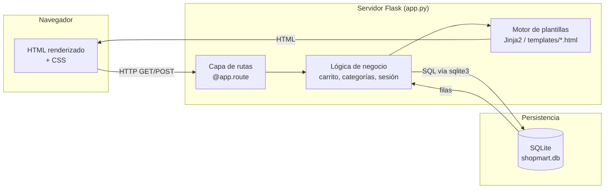
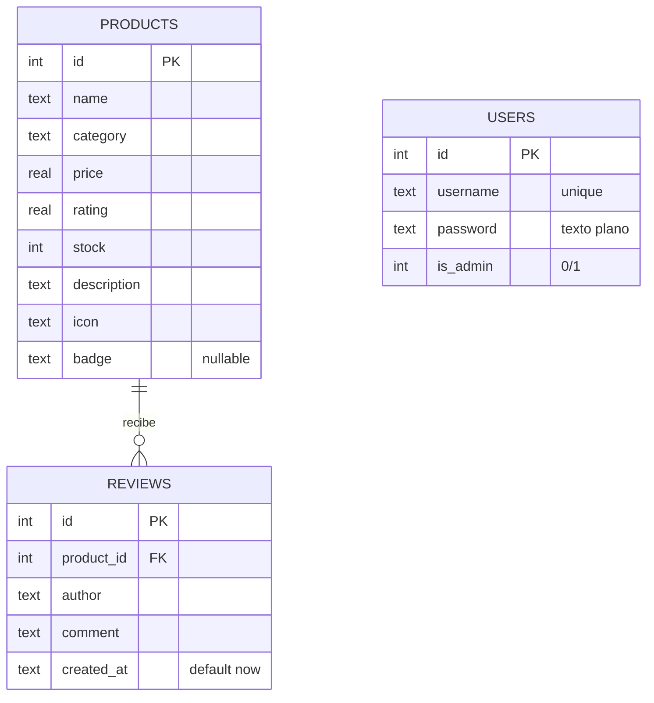
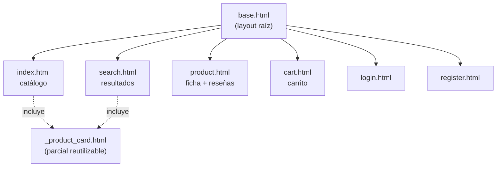
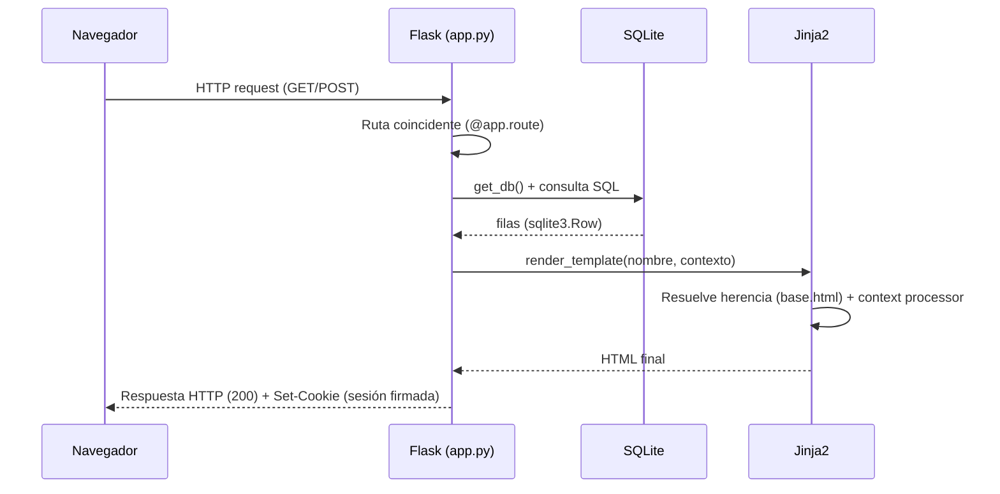

# ShopMart — Documentación Técnica

**Tipo de proyecto:** Aplicación web de e-commerce (laboratorio de seguridad)
**Propósito del laboratorio:** Servir como objetivo de un proceso de hallazgo y remediación de vulnerabilidades (SAST / DAST / SCA / secret scanning) dentro de un pipeline DevSecOps.
**Stack principal:** Python 3 · Flask · Jinja2 · SQLite · HTML/CSS (sin framework JS)

> Este documento describe **cómo está construida la aplicación**: arquitectura, backend, frontend, modelo de datos y flujos de funcionamiento. El detalle específico de cada vulnerabilidad intencional (CWE, forma de explotarla, remediación) ya está cubierto en `README.md` dentro del propio proyecto y no se duplica aquí; este documento se enfoca en el **funcionamiento** de la aplicación como sistema.

---

## 1. Resumen ejecutivo

ShopMart es una tienda en línea de demostración, con una interfaz similar a Amazon/eBay, que permite:

- Explorar un catálogo de productos por categoría.
- Buscar productos por nombre/descripción.
- Ver el detalle de un producto, su calificación y sus reseñas.
- Dejar una reseña como usuario anónimo o autenticado.
- Registrarse e iniciar sesión.
- Agregar/quitar productos de un carrito de compras (sin checkout real; no procesa pagos).

Es una aplicación **monolítica** de tipo *server-side rendered* (SSR): el servidor Flask arma el HTML completo con Jinja2 en cada respuesta; no hay una API REST ni un frontend desacoplado (no hay React/Vue ni llamadas AJAX/fetch relevantes).

---

## 2. Stack tecnológico

| Capa | Tecnología | Versión (requirements.txt) |
|---|---|---|
| Lenguaje | Python | 3.x |
| Framework web | Flask | 2.0.1 |
| Servidor WSGI de desarrollo | Werkzeug | 2.0.1 |
| Motor de plantillas | Jinja2 | 3.0.1 |
| Firma de cookies de sesión | itsdangerous | 2.0.1 |
| CLI de Flask | click | 8.0.1 |
| Base de datos | SQLite (archivo `shopmart.db`) | vía `sqlite3` (stdlib) |
| Dependencia adicional | PyYAML | 5.3.1 *(no se usa en el código de la app; incluida como caso de análisis de composición de software)* |
| Frontend | HTML5 + CSS3 (custom, sin framework) | — |
| Tipografías | Google Fonts: Fraunces, Inter, Space Grotesk | — |

No hay ORM (no usa SQLAlchemy): todas las consultas se escriben en SQL crudo contra el módulo `sqlite3` de la librería estándar. No hay build step de frontend (no webpack/vite): el CSS es un único archivo servido como estático.

---

## 3. Arquitectura general

Arquitectura monolítica de 3 capas clásicas, todo dentro de un único proceso Flask:



Puntos clave de la arquitectura:

- **Un solo archivo de rutas** (`app.py`) concentra toda la lógica de backend; no hay blueprints ni separación en módulos por dominio (típico de una app pequeña/didáctica).
- **`database.py`** actúa como capa de acceso a datos *mínima*: solo define el esquema y la siembra inicial (seed data); no encapsula las consultas de negocio, que viven directamente en `app.py`.
- **El estado de sesión** (usuario logueado, carrito) se guarda en la **cookie de sesión de Flask**, firmada criptográficamente con `app.secret_key`, no en la base de datos ni en el servidor.
- **No hay API JSON**: todas las rutas devuelven HTML ya renderizado. No existe separación frontend/backend en el sentido moderno (SPA + API).

---

## 4. Estructura del proyecto

```
shopmart/
├── app.py                    # Aplicación Flask: rutas y lógica de negocio
├── database.py                # Esquema de la BD + datos de siembra (seed)
├── requirements.txt           # Dependencias Python
├── README.md                  # Guía de instalación + mapa de vulnerabilidades
├── static/
│   └── css/
│       └── style.css          # Sistema de diseño y estilos (único archivo CSS)
└── templates/
    ├── base.html               # Layout raíz (navbar, categorías, footer)
    ├── index.html               # Página de inicio (catálogo + ofertas)
    ├── search.html               # Resultados de búsqueda
    ├── product.html               # Detalle de producto + reseñas
    ├── cart.html                   # Carrito de compras
    ├── login.html                   # Formulario de inicio de sesión
    ├── register.html                 # Formulario de registro
    └── _product_card.html             # Componente parcial reutilizable (tarjeta de producto)
```

`shopmart.db` (SQLite) se genera automáticamente en el primer arranque, dentro del mismo directorio del proyecto, y está excluida de control de versiones vía `.gitignore`.

---

## 5. Modelo de datos

La base de datos tiene tres tablas, creadas e inicializadas por `database.py` → `init_db()`:



Notas sobre el modelo:

- **`products`**: catálogo estático, sembrado con 9 productos de ejemplo repartidos en 4 categorías (Electrónica, Hogar, Moda, Deportes). El campo `badge` es opcional (`-20%`, `Nuevo`, etc.) y controla etiquetas visuales.
- **`reviews`**: relación 1→N con `products` vía `product_id` (clave foránea declarada pero **sin `ON DELETE`/integridad referencial forzada** por SQLite salvo que se active `PRAGMA foreign_keys`). Se llenan tanto por seed inicial como por el formulario público en la ficha de producto.
- **`users`**: no tiene relación con `reviews` ni `products` — las reseñas guardan el nombre como texto libre (`author`), no un `user_id`, por lo que cualquier visitante (autenticado o no) puede dejar una reseña con cualquier nombre.
- Las contraseñas se almacenan **en texto plano**, sin hash ni salt (deliberado, ver README de seguridad).

Usuarios sembrados de ejemplo: `admin` (con `is_admin=1`), `juan.perez` y `maria.lopez` (ambos `is_admin=0`).

---

## 6. Backend (`app.py`)

### 6.1 Inicialización

- Se crea la instancia `Flask(__name__)` y se fija `app.secret_key` (usada por Flask para firmar la cookie de sesión con `itsdangerous`).
- Se definen constantes de configuración a nivel de módulo (claves, contraseña de admin, cadena de conexión) — todas hardcodeadas en el código fuente.
- Al ejecutar `python app.py` directamente, se llama `init_db()` (crea/siembra la BD si no existe) y luego `app.run(...)` levanta el servidor de desarrollo Werkzeug en `127.0.0.1:5000` con `debug=True`.

### 6.2 Acceso a base de datos por request

```python
def get_db():
    # Reutiliza una única conexión SQLite por request, guardada en el
    # objeto especial `g` de Flask (contexto de aplicación).
    ...

@app.teardown_appcontext
def close_connection(exception):
    # Cierra la conexión automáticamente al terminar cada request.
    ...
```

Este patrón (`g` + `teardown_appcontext`) es el recomendado por Flask para bases de datos ligeras: evita abrir/cerrar conexiones manualmente en cada ruta y garantiza el cierre incluso si la ruta lanza una excepción.

### 6.3 Funciones auxiliares

| Función | Qué hace |
|---|---|
| `get_categories()` | Devuelve la lista de categorías distintas presentes en `products`, usada para armar el menú de categorías. |
| `get_cart_items()` | Lee el carrito guardado en `session["cart"]` (un dict `{product_id: cantidad}`), busca cada producto en la BD y calcula el total. |
| `inject_cart_count()` | **Context processor** de Flask: inyecta automáticamente `cart_count` y `categories` en el contexto de *todas* las plantillas, sin que cada ruta tenga que pasarlas explícitamente. |

### 6.4 Mapa de rutas

| Ruta | Método(s) | Función | Descripción |
|---|---|---|---|
| `/` | GET | `index()` | Catálogo completo o filtrado por `?cat=` (categoría) + banda de ofertas destacadas (`badge IS NOT NULL`). |
| `/search` | GET | `search()` | Búsqueda de productos por `name`/`description` usando el parámetro `q`. |
| `/product/<int:product_id>` | GET, POST | `product()` | GET: muestra la ficha del producto y sus reseñas. POST: inserta una nueva reseña (`author`, `comment`). |
| `/login` | GET, POST | `login()` | GET: formulario. POST: valida credenciales contra `users` e inicia sesión. |
| `/register` | GET, POST | `register()` | GET: formulario. POST: crea un usuario nuevo (`is_admin=0` por defecto) e inicia sesión automáticamente. |
| `/logout` | GET | `logout()` | Limpia la sesión (`session.clear()`) y redirige al inicio. |
| `/cart` | GET | `cart()` | Muestra el contenido del carrito y el total. |
| `/cart/add/<int:product_id>` | POST | `cart_add()` | Incrementa en 1 la cantidad de ese producto en `session["cart"]`. |
| `/cart/remove/<int:product_id>` | GET | `cart_remove()` | Elimina el producto del carrito. |

Todas las rutas devuelven HTML renderizado (`render_template`); no hay endpoints JSON.

### 6.5 Manejo de errores

El patrón repetido en `search()` y `login()` es capturar `sqlite3.OperationalError` alrededor de la ejecución de la consulta y, si falla, devolver una lista vacía / usuario nulo en lugar de romper la página. Esto evita un *stack trace* visible al usuario cuando una entrada malformada rompe la sintaxis SQL, pero no valida ni sanea la entrada en sí.

---

## 7. Frontend (Jinja2 + CSS)

### 7.1 Motor de plantillas y herencia

Todas las páginas extienden `base.html` mediante `` y sobrescriben el bloque ``. `base.html` concentra:

- `<head>` con metadatos, fuentes de Google Fonts y el enlace al CSS (`url_for('static', filename='css/style.css')`).
- Barra superior con enlaces de sesión (login/registro o "Hola, {usuario}" + cerrar sesión) según `session.get('user')`.
- Barra de navegación con el buscador (`GET /search`) y el contador de carrito (`cart_count`, inyectado globalmente).
- Riel de categorías, generado dinámicamente a partir de `categories` (también inyectado globalmente).
- Sistema de mensajes flash (`get_flashed_messages()`), usado por ejemplo tras iniciar sesión o registrarse.
- `<footer>` estático de navegación institucional.



`_product_card.html` es un *partial* (``) reutilizado tanto en `index.html` como en `search.html`, evitando duplicar el marcado de cada tarjeta de producto.

### 7.2 Sistema de diseño (CSS)

Un único archivo `static/css/style.css` (~540 líneas) define el sistema de diseño mediante variables CSS (`:root`):

- **Paleta**: tinta marina (`--ink #10233D`), ámbar (`--amber #E8A33D`), jade (`--jade #1B6B5B`) sobre fondo papel (`--paper #F3F5F0`).
- **Tipografía**: `Fraunces` (serif, para títulos/display), `Inter` (cuerpo de texto), `Space Grotesk` (precios y datos numéricos).
- **Motivo de marca**: una forma de "etiqueta de precio" (`clip-path` con muesca) reutilizada en badges y elementos destacados.
- Utilidades de layout (`.container`, grillas de producto), estados (`.low` para poco stock, `.active` para categoría seleccionada) y accesibilidad básica (`:focus-visible` con contorno marcado).

No hay CSS-in-JS ni preprocesadores: es CSS plano, cargado una sola vez y cacheable por el navegador como archivo estático.

### 7.3 Interactividad

No hay JavaScript de aplicación (no se usa `fetch`/AJAX ni un framework). Toda interacción (buscar, filtrar por categoría, agregar al carrito, dejar una reseña, iniciar sesión) se resuelve con **formularios HTML tradicionales** (`<form method="get|post">`) que provocan una recarga completa de página gestionada por Flask. Esto es coherente con el enfoque *server-rendered* de la app.

---

## 8. Flujos de funcionamiento

### 8.1 Ciclo de vida de una petición



### 8.2 Flujo: búsqueda y navegación de catálogo

1. El usuario escribe un término en el buscador de `base.html` (formulario `GET /search?q=...`) o hace clic en una categoría (`GET /?cat=...`).
2. `search()` o `index()` arma una consulta SQL contra `products` y renderiza `search.html` o `index.html`.
3. Cada resultado se pinta con el parcial `_product_card.html`.
4. Al hacer clic en un producto, se navega a `GET /product/<id>`.

### 8.3 Flujo: autenticación

```mermaid
flowchart TD
    A[Usuario envía formulario<br/>POST /login] --> B{Coincide<br/>username+password<br/>en tabla users?}
    B -- Sí --> C[session['user'] = username<br/>session['is_admin'] = bool]
    C --> D[Flash de bienvenida]
    D --> E[Redirect a '/']
    B -- No --> F[Muestra error genérico<br/>en login.html]
```

El registro (`/register`) sigue un flujo análogo: valida que el usuario no exista, inserta la fila en `users` con `is_admin=0` y **automáticamente inicia sesión** tras el registro (sin paso de verificación adicional).

### 8.4 Flujo: carrito de compras

- El carrito **no vive en la base de datos**: es un diccionario `{product_id: cantidad}` guardado directamente en la cookie de sesión (`session["cart"]`), por lo que es distinto por navegador/dispositivo y se pierde si el usuario borra cookies o cambia de sesión.
- `POST /cart/add/<id>` incrementa la cantidad y redirige de vuelta a la ficha del producto.
- `GET /cart` reconstruye la vista completa del carrito en cada carga, resolviendo cada `product_id` contra la tabla `products` (por lo que si un producto fue eliminado de la BD, simplemente se omite del carrito sin error).
- No hay checkout real: el botón "Proceder al pago" está deshabilitado (`disabled`) con un tooltip que aclara que es un entorno de laboratorio.

### 8.5 Flujo: reseñas de producto

1. `GET /product/<id>` muestra el producto y todas sus reseñas (`reviews` filtradas por `product_id`, más recientes primero).
2. El formulario de reseña envía `POST` a la misma ruta (`/product/<id>`).
3. Si hay `comment`, se inserta una fila en `reviews` (con `author` = "Anónimo" si no se especifica) y se hace `commit()`.
4. La misma petición POST vuelve a renderizar la página con las reseñas actualizadas (no hay `redirect` tras el POST, por lo que un refresh del navegador podría reenviar el formulario).

---

## 9. Gestión de estado y sesión

- Flask usa **cookies de sesión del lado del cliente** (no hay tabla de sesiones en servidor): todo el contenido de `session` (usuario, `is_admin`, carrito) se serializa, se firma con `app.secret_key` mediante `itsdangerous`, y se envía como cookie `Set-Cookie` al navegador.
- En cada request posterior, Flask verifica la firma de la cookie recibida y, si es válida, reconstruye el diccionario `session`.
- No hay expiración de sesión configurada explícitamente (`PERMANENT_SESSION_LIFETIME` no se toca), por lo que la sesión dura lo que dura la cookie de navegador (sesión de navegador, no "recuérdame" persistente) salvo que el navegador la retenga.
- El flag `is_admin` se guarda en la sesión en el momento del login (`session["is_admin"] = bool(user["is_admin"])`), pero **ninguna ruta de la aplicación verifica actualmente este flag** para restringir acceso: no existe un panel de administración ni rutas protegidas por rol en el código provisto.

---

## 10. Relación con el proyecto de hallazgo de vulnerabilidades

Esta app fue construida deliberadamente con puntos débiles reales de la industria (inyección SQL sin parametrizar, XSS por deshabilitar el autoescape de Jinja2 con `|safe`, secretos en el código fuente y una dependencia con CVE conocido), cada uno señalado en el propio código con comentarios `VULNERABILIDAD` y documentado en detalle —incluyendo CWE, forma de reproducirlo localmente y remediación esperada— en el `README.md` del proyecto. Ese README ya funciona como el **catálogo de hallazgos** de este laboratorio; este documento técnico está pensado como complemento: explica el funcionamiento de la aplicación como sistema para que sea más fácil ubicar en qué capa (ruta, plantilla, dependencia, configuración) se apoya cada hallazgo.

---

## 11. Cómo ejecutar el proyecto localmente

```bash
python3 -m venv venv
source venv/bin/activate        # Windows: venv\Scripts\activate
pip install -r requirements.txt
python app.py
```

La app queda disponible en `http://127.0.0.1:5000`. La base de datos SQLite se crea y siembra automáticamente en el primer arranque.

---

## 12. Posibles próximos pasos para la documentación del proyecto

- Diagrama de despliegue si se planea contenerizar la app (Dockerfile) para el pipeline DevSecOps.
- Documentar los *jobs* del pipeline CI/CD (ya hay una propuesta de etapas en el README de seguridad) como parte de un runbook aparte.
- Si se agregan roles/permisos reales (uso efectivo de `is_admin`), documentar el modelo de autorización correspondiente.
